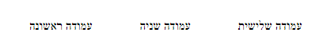
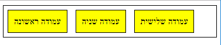
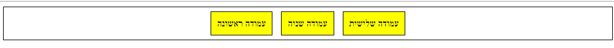
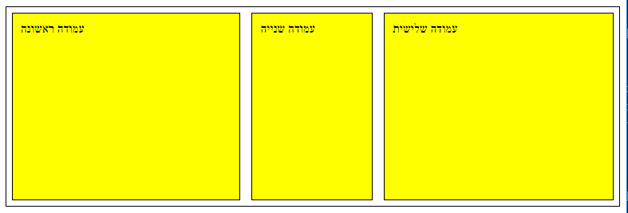
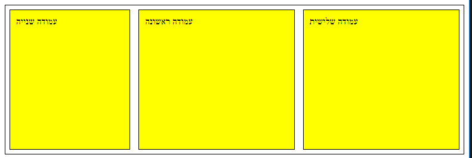

# Flex box (CSS3)


* Insted of using `float`:
```html
<!DOCTYPE html>
<html>
<head>
    <title></title>
    <meta name="viewport" content="initial-scale=1.0, user-scalable=no">
    <meta charset="utf-8">
    <style>
    p{
        float: left;
        margin: 30px;
    }
    </style>
</head>
<body>
    <div id="wrapper">
        <p class="column">עמודה ראשונה</p>
        <p class="column">עמודה שניה</p>
        <p class="column">עמודה שלישית</p>
    </div> 
</body>
</html>
```
and get this result:
<br>



* we can use `-webkit-box`:
```html
<!DOCTYPE html>
<html>

<head>
    <title></title>
    <meta name="viewport" content="initial-scale=1.0, user-scalable=no">
    <meta charset="utf-8">
    <style>
        #wrapper {
            width: 100%;
            display: -webkit-box;
        }

        p {
            margin: 30px;
        }
    </style>
</head>

<body>
    <div id="wrapper">
        <p class="column">עמודה ראשונה</p>
        <p class="column">עמודה שניה</p>
        <p class="column">עמודה שלישית</p>
    </div>
</body>

</html>
```
and get this result:
<br>


* we can display the `-webkit-box` content in this way (`vertical` / `horizontal`):
```html
<!DOCTYPE html>
<html>
<head>
    <title></title>
    <meta name="viewport" content="initial-scale=1.0, user-scalable=no">
    <meta charset="utf-8">
    <style>
        #wrapper {
            border: 1px solid black;
            width: 100%;
            display: -webkit-box;
            -webkit-box-orient: horizontal;
        }

        .column {
            border: 1px solid black;
            background-color: yellow;
            padding: 10px;
            margin: 7px;
        }
    </style>
</head>
<body>
    <div id="wrapper">
        <p class="column">עמודה ראשונה</p>
        <p class="column">עמודה שניה</p>
        <p class="column">עמודה שלישית</p>
    </div>
</body>
</html>

```
and get this result:
<br>



* We can align the content in the following way:
```html
<!DOCTYPE html>
<html>
<head>
    <title></title>
    <meta name="viewport" content="initial-scale=1.0, user-scalable=no">
    <meta charset="utf-8">
    <style>
        #wrapper {
            width: 100%;
            border: 1px solid black;
            display: -webkit-box;
            -webkit-box-orient: horizontal;
            -webkit-box-pack: center;
        }

        .column {
            border: 1px solid black;
            background-color: yellow;
            padding: 10px;
            margin: 7px;
        }
    </style>
</head>
<body>
    <div id="wrapper">
        <p class="column">עמודה ראשונה</p>
        <p class="column">עמודה שניה</p>
        <p class="column">עמודה שלישית</p>
    </div>
</body>
</html> 
```
and get this result:
<br>



* we can strech the conent of the `-webkit-box` in the following way:
```html
<!DOCTYPE html>
<html>
<head>
    <title></title>
    <meta name="viewport" content="initial-scale=1.0, user-scalable=no">
    <meta charset="utf-8">
    <style>
        #wrapper {
            border: 1px solid black;
            height: 250px;
            display: -webkit-box;
            -webkit-box-orient: horizontal;
            -webkit-box-pack: center;
            -webkit-box-align: stretch;
        }

        .column {
            border: 1px solid black;
            background-color: yellow;
            padding: 10px;
            margin: 7px;
            -webkit-box-flex: 3;
        }

        .column_stretch {
            -webkit-box-flex: 1;
            border: 1px solid black;
            background-color: yellow;
            padding: 10px;
            margin: 7px;
        }
    </style>
</head>
<body>

    <div id="wrapper">
        <p class="column">עמודה ראשונה</p>
        <p class="column_stretch">עמודה שנייה</p>
        <p class="column">עמודה שלישית</p>
    </div>

</body>
</html>
```
and get this result:
<br>


* we can change the location of each child in the following way:
```html
<!DOCTYPE html>
<html>
<head>
    <title></title>
    <meta name="viewport" content="initial-scale=1.0, user-scalable=no">
    <meta charset="utf-8">
    <style>
        #wrapper {
            border: 1px solid black;
            height: 250px;
            display: -webkit-box;
            -webkit-box-orient: horizontal;
            -webkit-box-pack: center;
            -webkit-box-align: stretch;
            -webkit-box-direction: reverse;
        }

        .column_right {
            border: 1px solid black;
            background-color: yellow;
            padding: 10px;
            margin: 7px;
            -webkit-box-flex: 1;
            width: 200px;
            -webkit-box-ordinal-group: 2;
        }

        .column_left {
            border: 1px solid black;
            background-color: yellow;
            padding: 10px;
            margin: 7px;
            -webkit-box-flex: 1;
            width: 200px;
            -webkit-box-ordinal-group: 1;
        }

        .column_stretch {
            -webkit-box-flex: 2.8;
            border: 1px solid black;
            background-color: yellow;
            padding: 10px;
            margin: 7px;
            -webkit-box-ordinal-group: 3;
        }
    </style>
</head>
<body>


    <div id="wrapper">
        <p class="column_right">עמודה ראשונה</p>
        <p class="column_stretch">עמודה שנייה</p>
        <p class="column_left">עמודה שלישית</p>
    </div>

</body>
</html>
```
and get this result:
<br>
